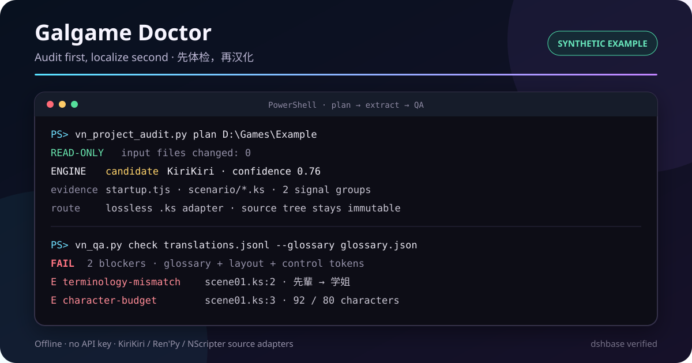

# Galgame Doctor for DeepSeek Harness

[中文](README.zh.md) | English

[](https://dshbase.com/plugins/dsh-galgame-localization-reverse/) [](https://github.com/julescules/dsh-galgame-localization-reverse/actions/workflows/ci.yml)

> [!IMPORTANT]
> Unofficial community plugin. Independently developed and maintained; not reviewed or endorsed by DeepSeek.

Audit first, reuse safely, localize second. Give DeepSeek Harness a visual-novel folder and get an evidence-backed engine candidate, safe translation migration, encoding clues, strict QA, and a reversible next step. The audit is offline and read-only; only report paths outside the audited tree are written.



## Start in 30 seconds

```powershell
dsh plugin --profile web add github:julescules/dsh-galgame-localization-reverse#v0.7.0
```

Restart DSH, then ask:

```text
Use galgame-localization-reverse to audit D:\Games\Example read-only.
Show the engine evidence, localization risks, and the safest next step.
```

No API key is required. The plugin contains no game assets, decrypted archives, credentials, or title-specific keys.

## What you get

### One-command localization plan

`vn_project_audit.py plan` inventories a bounded set of files and reports:

- engine candidates with confidence, signal groups, and concrete path evidence;
- script, archive, image, font, and executable candidates;
- bounded encoding samples and CJK-path-safe relative paths;
- a cautious classification of `candidate`, `weak-candidate`, or `unknown`;
- an evidence status, recommended route, exact next commands, risks, and release gates.

The classification is routing evidence, not a claim that static inspection proves runtime behavior.

```powershell
python -X utf8 skill\scripts\vn_project_audit.py plan D:\Games\Example `
  --json D:\project\logs\project-audit.json `
  --markdown D:\project\logs\project-audit.md
```

### Lossless source-script adapters

`vn_script_adapter.py` extracts plain KiriKiri `.ks`, Ren'Py `.rpy`, and NScripter `0.txt` text into UTF-8 JSONL while preserving source hash, line hash, path, line number, encoding, BOM, newline, prefix, and suffix. Apply always writes to a separate output root and fails if the source changed.

```powershell
python -X utf8 skill\scripts\vn_script_adapter.py extract D:\Games\Example `
  --engine kirikiri --output D:\project\translations.jsonl

python -X utf8 skill\scripts\vn_script_adapter.py apply D:\Games\Example `
  D:\project\translations.jsonl --output-root D:\project\rebuilt
```

It does not open XP3/NSA archives or claim compiled-script support.

### Safe translation migration after game updates

`vn_translation_memory.py` carries reviewed translations from one or more prior releases into a newly extracted catalog without silently guessing. Repeat `--previous` to combine histories. Exact conflicts across releases stay empty and return a non-zero status; fuzzy matches remain review-only. Every input remains unchanged and every catalog SHA-256 is recorded. The optional UTF-8 BOM CSV opens cleanly in Excel/WPS and keeps blank reviewer columns for decisions.

```powershell
python -X utf8 skill\scripts\vn_translation_memory.py migrate `
  --current D:\project\v2\translations.jsonl `
  --previous D:\project\v1\translations.jsonl `
  --previous D:\project\v1-hotfix\translations.jsonl `
  --output D:\project\v2\migrated.jsonl `
  --report D:\project\logs\translation-memory.json `
  --markdown D:\project\logs\translation-memory.md `
  --review-csv D:\project\review\translation-memory.csv
```

### Strict translation preflight

`vn_qa.py` rejects missing, added, or reordered control tokens by default. v3 adds glossary and forbidden-term gates, repeated-source consistency, character/line budgets, punctuation balance, empty translations, residual Japanese, and target-encoding checks. Generic JSON/JSONL, script-adapter JSONL, and GalTransl cache fields are supported without third-party packages.

```powershell
python -X utf8 skill\scripts\vn_qa.py check-jsonl D:\project\translations.jsonl `
  --encoding gbk --require-complete --require-consistent `
  --glossary D:\project\glossary.json --max-chars 80 --max-lines 3 --check-punctuation `
  --report D:\project\logs\translation-qa.json `
  --markdown D:\project\logs\translation-qa.md
```

An intentionally broken synthetic fixture produces a concise failure report:

```text
FAIL  2 blockers · 3 segments
E control-token-added  scene01:2  added [wait]
E empty-translation    scene01:3  translation required
```

### Release evidence, not another translator

The bundled workflow also provides:

- `vn_patch.py` — hash-bound file replacement, verification, backup, and rollback;
- `vn_image_qa.py` — PNG/APNG, JPEG, GIF, and BMP geometry/alpha/frame comparison;
- `vn_slot_qa.py` — fixed-slot terminator, padding, marker, and outside-region checks;
- focused routes for AI6WIN, BGI/Ethornell, Director, RealLive, Delphi/DirectDraw, PSP/Vita, Ren'Py, KiriKiri, and custom engines.

GalTransl, VNTextPatch, GARbro, LunaTranslator, and engine-specific tools can handle translation or extraction. Galgame Doctor complements them by deciding what the project appears to be, checking their text output, and preserving release evidence.

## Try the synthetic examples

```powershell
python -X utf8 skill\scripts\vn_project_audit.py plan examples\synthetic-project\game `
  --json test_outputs\synthetic-audit.json `
  --markdown test_outputs\synthetic-audit.md

python -X utf8 skill\scripts\vn_qa.py check-jsonl examples\translations.jsonl `
  --encoding gbk --require-complete --glossary examples\glossary.json `
  --report test_outputs\translation-qa.json `
  --markdown test_outputs\translation-qa.md
```

All example text is synthetic and redistributable.

## DSH integration

The bundle uses the official packaged Skill Provider shape:

- `inject = ['skills']`;
- `ctx.skills.registerProvider(...)`;
- directory `resourceBase` for on-demand references and scripts;
- the official `dsh.bundle.patch` install path.

The registered name remains `galgame-localization-reverse`, so existing prompts continue to work.

## Verify the package

```powershell
npm run check
npm pack --dry-run
node scripts/build-release-metadata.mjs .\dsh-galgame-localization-reverse-0.7.0.tgz .\builds\v0.7.0
.\scripts\verify-release.ps1 -PackagePath .\dsh-galgame-localization-reverse-0.7.0.tgz -ChecksumsPath .\builds\v0.7.0\SHA256SUMS
```

The check runs provider tests plus deterministic self-tests for planning, script adapters, translation-memory migration, translation QA, and all bundled patch/asset utilities. Each release also publishes SHA-256 and CycloneDX SBOM evidence.

## Limits

- Engine formats and binary constants remain title/version specific until proven against exact hashes.
- Script adapters support plain source files only and never imply archive/compiled-script compatibility.
- Static audit and QA do not replace a zero-mutation round trip or in-game UI, save/load, audio, and rollback tests.
- Residual Japanese can be intentional; review each finding or maintain an explicit exclusion instead of silently weakening the gate.
- DeepSeek Harness is in developer preview; pin a reviewed plugin release.

See [CONTRIBUTING.md](CONTRIBUTING.md) and [SECURITY.md](SECURITY.md) for contribution and reporting guidance.

## License

[MIT](LICENSE)
