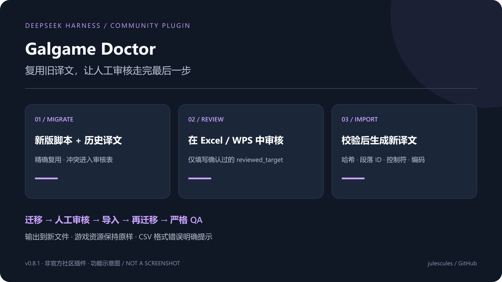

# DeepSeek Harness Galgame Doctor

本版更新：审核 CSV 的重复列名、缺失单元格、多余单元格均给出明确错误；演示图展示完整审核流程。


**游戏更新后复用旧译文，把人工审核结果可靠地带回汉化流程。**

| 你手上的材料 | 插件能给你的结果 |
|---|---|
| 不熟悉的游戏目录 | 引擎候选、文件证据和下一步计划 |
| 旧译文与新版脚本 | 精确复用、冲突报告和审核表 |
| 人工改好的审核表 | 校验后生成新的译文 JSONL |
| 待发布补丁 | 控制符、编码、资源与回滚检查 |

本版补齐审核闭环：迁移时用 `--review-csv review.csv` 导出表格，在 Excel/WPS 中填写确认过的 `reviewed_target`，再导回：

```powershell
python -B -X utf8 skill/scripts/vn_review.py --current current.jsonl --review-csv review.csv --output reviewed.jsonl --encoding gbk
```

`current.jsonl` 必须是迁移时原始 current 文件，不能换成 migrated 输出。导入器核对哈希、重复/未知段落、控制符和目标编码；所有行通过后才生成新文件，空白审核项保留待办。支持默认字段 `segment_id/source/target`。接着以 reviewed.jsonl 为 current 再做一次历史迁移，合并精确复用结果，最后运行严格 QA。

安装本版：`dsh plugin --profile web add github:julescules/dsh-galgame-localization-reverse#v0.8.1`，然后重启 DSH。

中文 | [English](README.md)

[](https://dshbase.com/zh/plugins/dsh-galgame-localization-reverse/) [](https://github.com/julescules/dsh-galgame-localization-reverse/actions/workflows/ci.yml)

> [!IMPORTANT]
> 非官方社区插件，由社区独立开发与维护，未经 DeepSeek 审核或背书。

先体检，安全复用，再汉化。把视觉小说目录交给 DeepSeek Harness，得到带证据的引擎候选、安全翻译迁移、编码线索、严格 QA 和可回滚的下一步。体检完全离线且只读；只允许把报告写到被审计目录之外。



## 30 秒开始

```powershell
dsh plugin --profile web add github:julescules/dsh-galgame-localization-reverse#v0.8.1
```

重启 DSH，然后直接说：

```text
请使用 galgame-localization-reverse 对 D:\Games\Example 做只读体检，
列出引擎证据、汉化风险和最安全的下一步。
```

不需要 API Key。插件不包含游戏资源、解密封包、凭据或作品专用密钥。

## 能得到什么

### 一条命令生成汉化计划

`vn_project_audit.py plan` 在受限范围内盘点文件，并报告：

- 带置信度、信号组和实际相对路径证据的引擎候选；
- 剧本、封包、图片、字体和可执行文件候选；
- 有上限的编码抽样，以及安全显示的中文／日文路径；
- 谨慎的 `candidate`、`weak-candidate` 或 `unknown` 分类；
- 证据状态、推荐路线、准确的下一条命令、风险和发布门禁。

分类只用于选择路线，不代表静态检查已经证明运行时行为。

```powershell
python -X utf8 skill\scripts\vn_project_audit.py plan D:\Games\Example `
  --json D:\project\logs\project-audit.json `
  --markdown D:\project\logs\project-audit.md
```

### 可往返的源脚本适配器

`vn_script_adapter.py` 将普通 KiriKiri `.ks`、Ren'Py `.rpy` 和 NScripter `0.txt` 文本提取为 UTF-8 JSONL，同时保存源文本哈希、整行哈希、路径、行号、编码、BOM、换行、前缀和后缀。回注始终写入独立输出目录；原文发生变化时 fail closed。

```powershell
python -X utf8 skill\scripts\vn_script_adapter.py extract D:\Games\Example `
  --engine kirikiri --output D:\project\translations.jsonl

python -X utf8 skill\scripts\vn_script_adapter.py apply D:\Games\Example `
  D:\project\translations.jsonl --output-root D:\project\rebuilt
```

它不会打开 XP3/NSA 封包，也不宣称支持编译剧本。

### 游戏更新后的安全翻译迁移

`vn_translation_memory.py` 可把一个或多个旧版本中的已审校译文迁移到新提取文本表，但不会暗中猜测。重复使用 `--previous` 即可合并多个历史版本；跨版本精确译文冲突时保持空白并返回非零状态，模糊匹配只进入人工复核队列。报告记录每份输入的 SHA-256。可选的 UTF-8 BOM CSV 能直接交给 Excel/WPS，并预留人工译文与备注列。

```powershell
python -X utf8 skill\scripts\vn_translation_memory.py migrate `
  --current D:\project\v2\translations.jsonl `
  --previous D:\project\v1\translations.jsonl `
  --previous D:\project\v1-hotfix\translations.jsonl `
  --output D:\project\v2\migrated.jsonl `
  --report D:\project\logs\translation-memory.json `
  --markdown D:\project\logs\translation-memory.md `
  --review-csv D:\project\review\translation-memory.csv
```

### 严格翻译门禁

`vn_qa.py` 默认阻断控制标记缺失、新增或重排。v3 新增术语表、禁用词、重复原文译法一致性、字符/行数预算、标点配对、空译、残留日文和目标编码检查。无需第三方包即可读取通用 JSON/JSONL、脚本适配器 JSONL 和 GalTransl 缓存字段。

```powershell
python -X utf8 skill\scripts\vn_qa.py check-jsonl D:\project\translations.jsonl `
  --encoding gbk --require-complete --require-consistent `
  --glossary D:\project\glossary.json --max-chars 80 --max-lines 3 --check-punctuation `
  --report D:\project\logs\translation-qa.json `
  --markdown D:\project\logs\translation-qa.md
```

仓库内故意损坏的合成样例会产生直观报告：

```text
FAIL  2 blockers · 3 segments
E control-token-added  scene01:2  added [wait]
E empty-translation    scene01:3  translation required
```

### 发布证据，而不是再造一个翻译器

插件还自带：

- `vn_patch.py`：哈希绑定的文件替换、验证、备份与回滚；
- `vn_image_qa.py`：比较 PNG/APNG、JPEG、GIF、BMP 的尺寸、alpha 和帧数；
- `vn_slot_qa.py`：检查固定槽终止符、填充、控制标记和槽区外改动；
- 面向 AI6WIN、BGI/Ethornell、Director、RealLive、Delphi/DirectDraw、PSP/Vita、Ren'Py、KiriKiri 和自定义引擎的专门路线。

GalTransl、VNTextPatch、GARbro、LunaTranslator 和引擎专用工具负责翻译或提取；Galgame Doctor 负责判断项目像什么、检查它们的文本输出，并保存可审计的发布证据。

## 运行合成样例

```powershell
python -X utf8 skill\scripts\vn_project_audit.py plan examples\synthetic-project\game `
  --json test_outputs\synthetic-audit.json `
  --markdown test_outputs\synthetic-audit.md

python -X utf8 skill\scripts\vn_qa.py check-jsonl examples\translations.jsonl `
  --encoding gbk --require-complete --glossary examples\glossary.json `
  --report test_outputs\translation-qa.json `
  --markdown test_outputs\translation-qa.md
```

所有示例文本均为原创合成数据，可公开再分发。

## DSH 集成方式

插件使用官方打包 Skill Provider 结构：

- `inject = ['skills']`；
- `ctx.skills.registerProvider(...)`；
- 通过目录 `resourceBase` 按需读取参考和脚本；
- 使用官方 `dsh.bundle.patch` 安装入口。

注册名仍是 `galgame-localization-reverse`，已有提示词无需修改。

## 验证包

```powershell
npm run check
npm pack --dry-run
node scripts/build-release-metadata.mjs .\dsh-galgame-localization-reverse-0.8.1.tgz .\builds\v0.8.1
.\scripts\verify-release.ps1 -PackagePath .\dsh-galgame-localization-reverse-0.8.1.tgz -ChecksumsPath .\builds\v0.8.1\SHA256SUMS
```

检查包含 Provider 测试，以及计划生成、脚本适配、翻译记忆迁移、翻译 QA 和全部补丁／资源工具的确定性自测。每个 Release 还会发布 SHA-256 与 CycloneDX SBOM 证据。

## 边界

- 引擎格式和二进制常量在绑定具体版本哈希前都只是候选。
- 脚本适配器只支持普通源文件，不代表封包或编译剧本已经兼容。
- 静态体检与 QA 不能代替零变更回注和实际 UI、存读档、音频、回滚测试。
- 残留日文可能是有意保留项；应逐条审阅或维护明确排除表，不能静默放宽门禁。
- DeepSeek Harness 尚处于开发预览阶段，请固定到已审阅的插件版本。

贡献与安全报告方式见 [CONTRIBUTING.md](CONTRIBUTING.md) 和 [SECURITY.md](SECURITY.md)。

## 许可

[MIT](LICENSE)

兼容性：已在 DSH 0.1.2-rc.1 运行验证。官方 GitHub 已发布 0.1.3-alpha.1，但截至 2026-09-06 对应 npm 包未能获取，尚未完成该 alpha 的运行验证。
